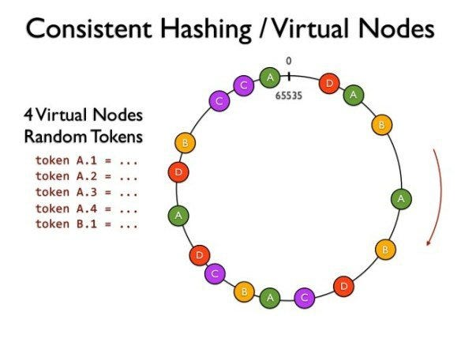

# Ring Hashing

**Domain:** Distributed Systems
**Tags:** #hashing #ringHashing
**Last updated:** 2026-05

## What it is

Ring hashing is considering the data as a circle and placing servers alongside the circle.

## Why it matters

This approach of consistent hashing matters because it makes it simpler to add / remove a server as it allows for less data relocation.

## Key points

- ...
- ...
- ...
